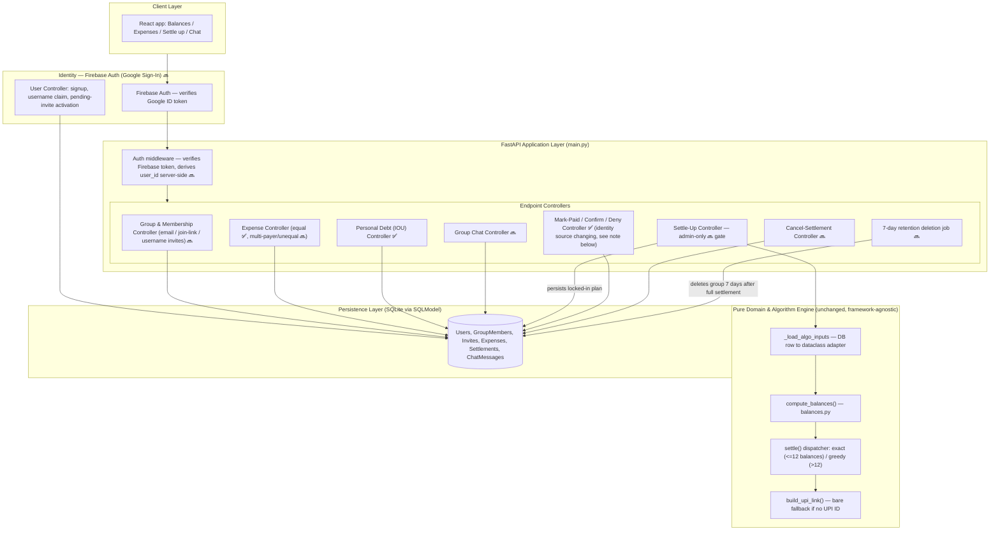
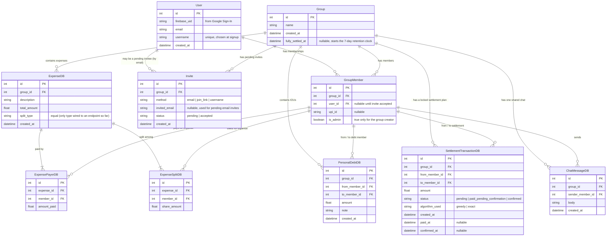
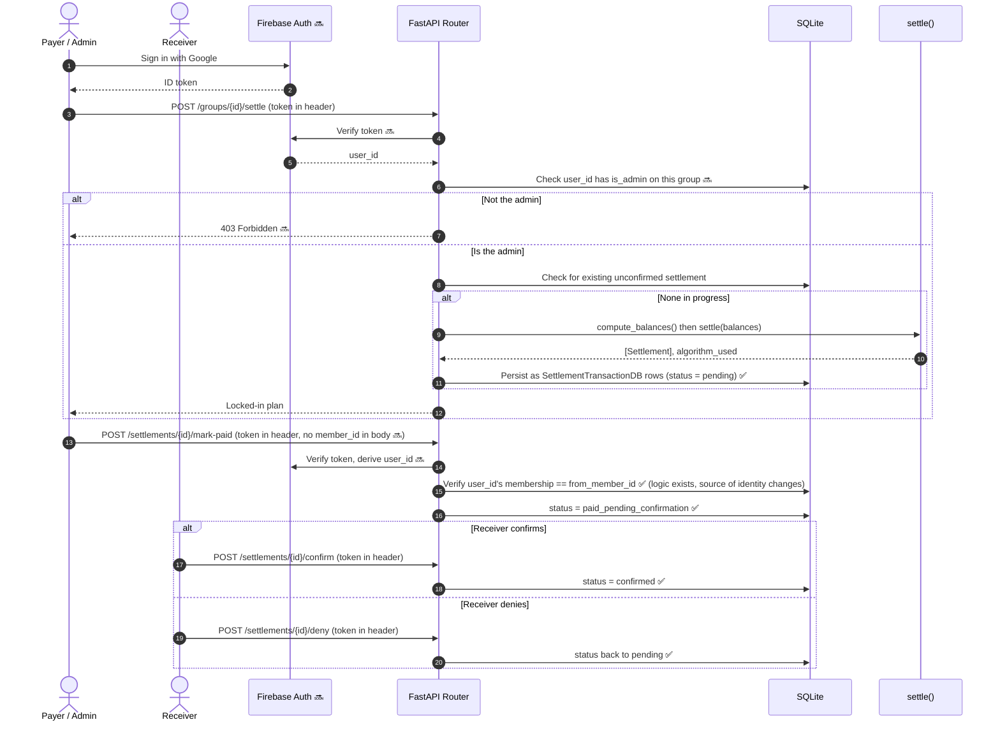
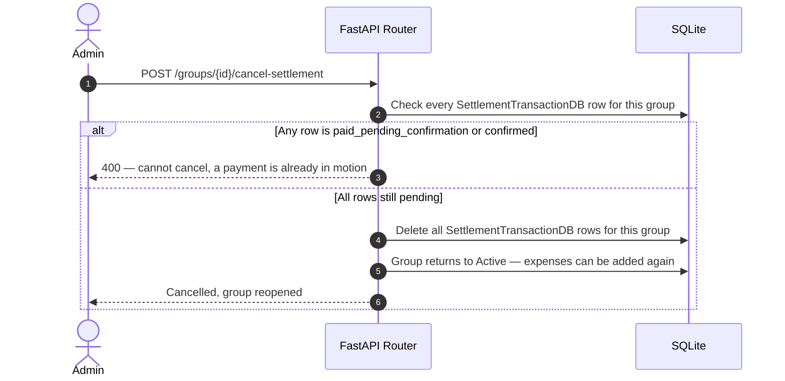
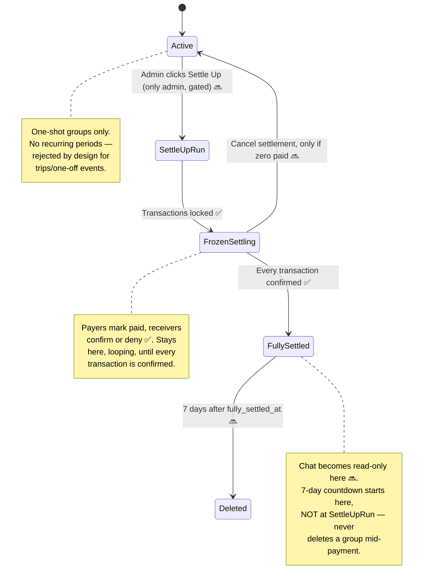

# System Architecture & UI/UX Breakdown: Debt-Settle

This document reflects the **fully finalized architecture** after resolving every open design question — identity, admin authority, cancel rules, retention, and feature order. The core algorithm and confirmation-flow backend are built and tested; everything from the identity overhaul onward is a locked-in decision, not yet built.

Status legend: **✅ Built & tested** · **🧩 Backend built, frontend not wired yet** · **🔜 Planned, decided, not yet built**

---

# PART 1: Technical System Architecture

## 1. High-Level Component Architecture

The core algorithm layer (`models.py`, `balances.py`, `settlement_greedy.py`, `settlement_exact.py`, `settle.py`, `upi.py`) remains framework-agnostic and unchanged by everything below — identity and authorization live entirely in the route layer, never touching the algorithm.



**Important correction this update makes**: the built `mark-paid`/`confirm`/`deny` endpoints currently trust a client-supplied `member_id` in the request body (the `ActingAs` schema). Once Firebase Auth is in place, this becomes a real security hole — anyone could claim to be anyone by just changing that field. The auth middleware must derive the acting user's identity **server-side from the verified Firebase token**, and `ActingAs` should be removed from the request body entirely. This is a required change, not just an addition.

**Deployment**: API on Render/Railway, frontend on Vercel.

---

## 2. Entity Relationship Diagram (Database Schema)

This reflects the identity overhaul: `User` is now a global account, `GroupMember` is a membership link (not a bare name), and `Invite` covers all three ways to add someone to a group.



**What changed from the previous version of this doc**: `GroupMember` no longer holds a `name` directly — it now points to a `User`, which carries the name/username instead. A new `Invite` table covers all three add-methods (email/pending, join link, username), replacing the old plain "type a name" flow entirely.

**Confirmed as one-shot**: there is deliberately no `SettlementPeriod` or recurring-billing concept anywhere in this schema. Every group settles exactly once, then is deleted 7 days after `fully_settled_at`.

---

## 3. End-to-End Sequence: Settle Up → Mark Paid → Confirm

✅ **The core of this flow is built and tested.** The additions below (admin check, identity via token) are the decided-but-not-yet-built changes layered on top.



---

## 4. Cancel-Settlement Sequence — 🔜 Planned, not built



---

## 5. Group Lifecycle & Retention State Diagram



---

# PART 2: UI/UX Architectural Breakdown

## 1. Information Architecture & Screen Flow

```mermaid
stateDiagram-v2
    [*] --> SignIn : 🔜 Google Sign-In via Firebase
    SignIn --> Dashboard : 🔜 group list, not built yet

    state Dashboard {
        [*] --> GroupList
        GroupList --> CreateGroupModal : "+ New group"
        CreateGroupModal --> InviteStep : Add members 🔜
    }

    state InviteStep {
        [*] --> ChooseMethod
        ChooseMethod --> EmailInvite : By email (pending until signup) 🔜
        ChooseMethod --> JoinLink : Shareable join link 🔜
        ChooseMethod --> UsernameInvite : By exact username 🔜
    }

    Dashboard --> GroupDetailScreen : Select a group

    state GroupDetailScreen {
        [*] --> BalancesTab
        BalancesTab --> ExpensesTab : Switch tab
        ExpensesTab --> AddExpenseModal : "+ Add expense" 🧩
        BalancesTab --> SettleModal : "Settle up" 🔜 admin-only button
        GroupDetailScreen --> ChatTab : 🔜 planned, read-only once fully settled
    }

    state SettleModal {
        [*] --> PaymentList
        PaymentList --> ExternalUPIApp : "Pay via UPI" 🧩
        PaymentList --> MarkPaidState : "Mark as paid" 🔜
        MarkPaidState --> ReceiverConfirmState : Receiver confirms or denies 🔜
        PaymentList --> CancelSettlement : "Cancel" 🔜 (only if nothing paid yet)
    }
```

---

## 2. Feature-by-Feature UI/UX Breakdown & Click Behaviors

---

### 🟢 Feature 1: Sign-In & Group/Member Creation — 🔜 Planned (identity model changed)

#### Intended Visual Mockup
```
+-----------------------------------------------------------------------+
|  Debt-Settle                              [ Signed in as @anish_ks ]  |
+-----------------------------------------------------------------------+
|  Your expense groups                                   [ + New group ]|
|  +---------------------------+  +----------------------------------+  |
|  | Goa Trip 2026 (admin: you) |  | Room 214 mess (admin: Diya)      |  |
|  | 4 members - 3 expenses     |  | 4 members - 12 expenses          |  |
|  +---------------------------+  +----------------------------------+  |
+-----------------------------------------------------------------------+
```

#### Click Event Breakdown: `[ + New group ]` → invite step
1. **User action**: Names the group, then adds each member via one of three methods:
   - **By email**: types `karan@gmail.com` → an `Invite` row is created with `status: pending`; the moment anyone signs in with that Gmail account, they're auto-attached to this group.
   - **By join link**: generates one shareable link for the whole group; anyone signed in who opens it joins immediately.
   - **By username**: types `@karan_k` → exact match required against existing `User.username`, added immediately (no pending state, since the account already exists).
2. **Whoever created the group is automatically `is_admin: true`** on their `GroupMember` row — this is what the settle-up gate checks later.

---

### 🔵 Feature 2: Adding an Expense (Equal Split) — 🧩 Backend built, frontend mockup runs on mock data
*(unchanged from before — this part of the system isn't affected by the identity overhaul)*

```
+-----------------------------------------------------------------------+
|  Add expense                                                          |
|  Description:  [ Mess lunch__________________________ ]               |
|  Amount:       [ 2000_________________________________ ]              |
|  Paid by:      [ Aarav v ]                                            |
|  Split among:  [x] Aarav  [x] Diya  [x] Karan  [x] Meera               |
|                                          [ Save expense ]              |
+-----------------------------------------------------------------------+
```
`POST /groups/{group_id}/expenses/equal` — ✅ real endpoint, unchanged.

---

### 🟡 Feature 3: Net Balances Dashboard — 🧩 Backend built, frontend mockup built
*(unchanged — `GET /groups/{group_id}/balances`, still `compute_balances()` under the hood, still verifies balances sum to zero)*

---

### 🔴 Feature 4: Settle Up & Payment Confirmation — ✅ Core logic built and tested · 🔜 Admin gate + real identity not yet added

```
+-----------------------------------------------------------------------+
|  Settle up — 3 payments (exact algorithm)          [admin: only you]  |
+-----------------------------------------------------------------------+
|  Meera -> Diya          Rs.1900.00        [ pending ]                 |
|                          [ Pay via UPI ]   [ Mark as paid ]            |
|  Karan -> Diya          Rs.200.00         [ paid - awaiting confirm ] |
|                          (Diya sees:)  [ Confirm received ] [ Deny ]  |
|  Karan -> Aarav         Rs.100.00         [ confirmed ]               |
|                                                       [ Cancel 🔜 ]    |
+-----------------------------------------------------------------------+
```

**What's still accurate from before**: the `mark-paid`/`confirm`/`deny` state machine, the 403 checks, and the deny-resets-to-pending anti-cheat mechanism are all built and tested exactly as documented previously.

**What's new**: the `[ Cancel ]` button (Feature 7 below), and the fact that `Settle up` itself will reject anyone who isn't the group admin.

---

### 🟣 Feature 5: Group Freeze on Settle Up — 🔜 Planned, decided, not built
Same as before: once settle-up locks in a plan, no more expenses can be added to that group. Still not enforced in `main.py` yet.

---

### 🟤 Feature 6: Group Chat — 🔜 Planned, nothing built
Same design as before — one shared chat per group, goes read-only the instant every settlement transaction is confirmed. No `ChatMessageDB`, no routes, no UI yet.

---

### ⚪ Feature 7: Cancel Settlement — 🔜 New, planned, not built
```
+-----------------------------------------------------------------------+
|  Settle up — 3 payments                                               |
|  ...                                                                   |
|  [ Cancel settlement ]  <- only enabled while every row is "pending"   |
+-----------------------------------------------------------------------+
```
Clicking this while any transaction has been marked paid does nothing but show why it's disabled — the button itself should be visually disabled once the first "Mark as paid" happens anywhere in the group, not just rejected server-side after the click.

---

### ⚪ Feature 8: 7-Day History Retention — 🔜 New, planned, not built
No user-facing button — this is a background job. Once every transaction in a group reaches `confirmed`, `Group.fully_settled_at` is stamped. A scheduled job checks daily for groups past that timestamp + 7 days and deletes them outright. Worth showing a small "deletes in N days" label on a fully-settled group in the dashboard, so it isn't a silent surprise.

---

## 3. Frontend State Variables (intended, once wired to the real API)

| State variable | Scope | Trigger | Built status |
| :--- | :--- | :--- | :--- |
| `currentUser` | Global | Firebase sign-in | 🔜 not designed yet |
| `currentGroup` | Screen state | Group selected | 🧩 mock only |
| `members` | Group level | `GET /groups/{id}` | 🧩 mock only |
| `expenses` | Group level | Add expense / `GET /expenses` | 🧩 mock only |
| `balances` | Calculated state | `GET /groups/{id}/balances` | 🧩 mock only |
| `settlementPlan` | Group level | `POST /settle`, then `GET /settlements` | 🔜 not in frontend yet |
| `isAdmin` | Group level | Derived from `currentUser` + `members` | 🔜 gates the Settle Up button |
| `chatMessages` | Group level | `GET /chat` | 🔜 planned |

**This table's open question from the previous version is now resolved**: `actingMemberId` is gone entirely — identity comes from the Firebase-verified `currentUser`, matched against group membership server-side. No client ever needs to say who it is; the token proves it.
